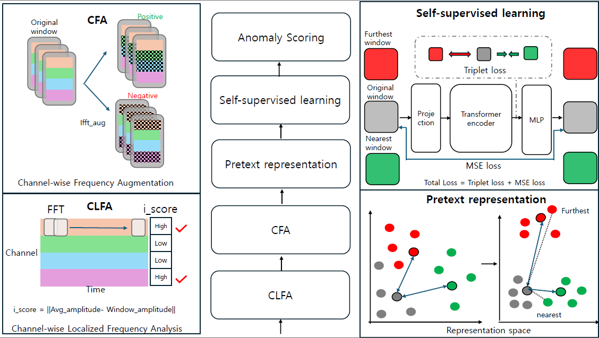
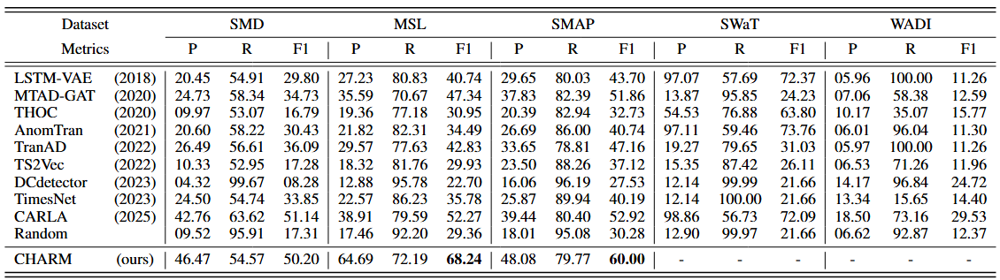

# CHARM

**CHARM: CHannel-wise frequency-guided Augmentation for contrastive learning and Reconstruction in Multivariate time series anomaly detection**

As the number of time series data used in many applications increases, multivariate time series anomaly detection has become more important. Due to the lack of labelled data, many existing methods employ unsupervised manner such as contrastive learning or reconstruction method to learn normal data patterns. However, these methods often fall short on capturing informative channel correlations relevant for anomaly detection. In this paper, we propose a novel framework that identifies informative channels using localized frequency analysis and simple statistics. These channels guide the generation of contrastive pairs, and the model is trained using a combination of contrastive learning and reconstruction to capture fine-grained channel structures. Specifically, we apply FFT to each channel over sliding windows and select those whose frequency amplitudes significantly deviate from their own average. We then apply inverse FFT augmentation to these channels to generate negative samples, and similarly augment the remaining channels to obtain positive samples for contrastive learning. Additionally, using the representation space learned from contrastive samples, we classify each window based on both its similarity to the nearest and farthest neighbors and its reconstruction error. Experiments on real-world datasets demonstrate that our model outperforms baselines.



## 	Get Started

1. Install Python 3.9.13, PyTorch 1.11.0.

2. Download data. You can obtain two benchmarks from [Google Cloud](https://drive.google.com/drive/folders/1UJ6SGfb6h-9R0L18FLDXpISKh1nhaqWA?usp=sharing). The datasets are well pre-processed. For the SWaT dataset, you can apply for it by following its [official tutorial](https://itrust.sutd.edu.sg/itrust-labs_datasets/dataset_info/). We unify the SWaT dataset to minute granularity and retain only continuous metrics:

   ```
   'AIT201', 'AIT202', 'AIT203', 'AIT401', 'AIT402', 'AIT501',
   'AIT502', 'AIT503', 'AIT504', 'DPIT301', 'FIT101', 'FIT201',
   'FIT301', 'FIT401', 'FIT501', 'FIT502', 'FIT503', 'FIT504',
   'FIT601', 'LIT101', 'LIT301', 'LIT401', 'PIT501', 'PIT502',
   'PIT503'
   ```

3. Train and evaluate. You can reproduce the experiment results as follows:

   ```shell
   bash ./script/run.sh
   ```

## Main Result

---------------------



## Citation

<!-- If you find this repo or our work useful for your research, please consider citing the paper:

```tex
@inproceedings{,
  author    = {Chengsen Wang and Zirui Zhuang and Qi Qi and Jingyu Wang and Xingyu Wang and Haifeng Sun and Jianxin Liao},
  title     = {Drift doesn't matter: Dynamic decomposition with diffusion reconstruction for unstable multivariate time series anomaly detection},
  booktitle = {Neural Information Processing Systems},
  year      = {2023},
}
``` -->

<!-- ## Contact

If you have any question, please contact [jaehyeop.hong@inha.edu](jaehyeop.hong@inha.edu). -->